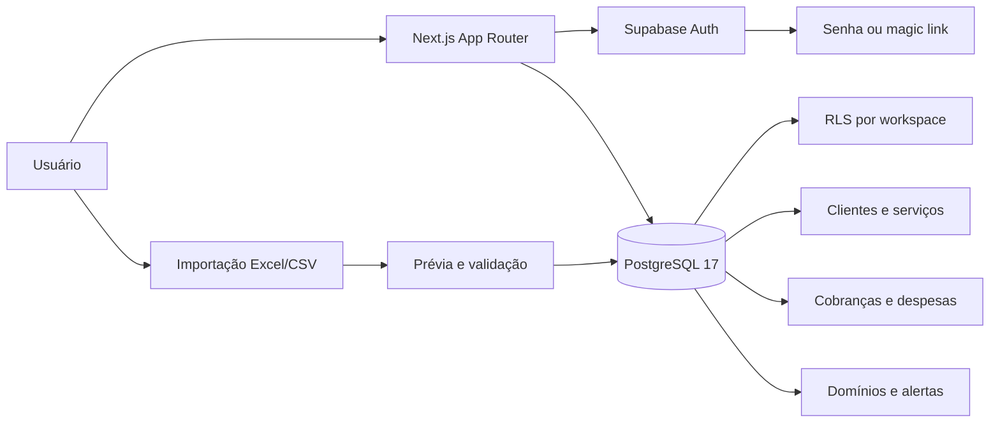

<div align="center">
  
  <h1>💰 Fate Light</h1>
  <h3>Clareza financeira. Caminho Certo.</h3>
  <p>
    Centralize clientes, serviços, cobranças, despesas e domínios em um workspace seguro,<br />
    com visão clara do caixa e dos próximos vencimentos.
  </p>
  <p>
    <a href="https://github.com/RDEsley/Fate-Light/actions/workflows/ci.yml"></a>
    <a href="package.json"></a>
    <a href="https://nextjs.org/"></a>
    <a href="https://react.dev/"></a>
    <a href="https://www.typescriptlang.org/"></a>
    <a href="https://supabase.com/"></a>
    <a href="https://fate-eight-project-richards-projects-42fb7402.vercel.app"></a>
    <a href="LICENSE"></a>
  </p>
  <p>
    <a href="#-funcionalidades">Funcionalidades</a> •
    <a href="https://fate-eight-project-richards-projects-42fb7402.vercel.app">Abrir sistema</a> •
    <a href="#-tecnologias">Tecnologias</a> •
    <a href="#-instalação-local">Instalação</a> •
    <a href="#-deploy-na-vercel">Deploy</a> •
    <a href="#-qualidade-e-testes">Testes</a> •
    <a href="#-segurança">Segurança</a> •
    <a href="#-créditos">Créditos</a>
  </p>
</div>

---

## 📌 Sobre o projeto

O **Fate Light** é um sistema de gestão financeira operacional desenvolvido pela **Fate Light Tech**.
A própria empresa utiliza o produto no dia a dia, mas ele foi projetado para atender também agências,
prestadores de serviços e outros negócios que precisam substituir controles dispersos em planilhas.

A aplicação acompanha o ciclo completo, desde o cadastro do cliente até o recebimento, sem misturar
a receita da empresa com a verba administrada de mídia.

O sistema oferece autenticação por e-mail e senha ou magic link, cadastro com nome pessoal ou da
empresa, isolamento por workspace e políticas de segurança no banco. A interface em PT-BR adota um
tema claro suave, identidade cartoon própria, navegação lateral responsiva e recursos persistentes
de acessibilidade.

> **Status:** MVP operacional. O fluxo principal está implementado e validado localmente com banco,
> testes automatizados e navegador real.

## ✨ Funcionalidades

| Área              | Recursos disponíveis                                                                                                           |
| ----------------- | ------------------------------------------------------------------------------------------------------------------------------ |
| 📊 **Dashboard**  | Saudação pessoal, workspace atual, receitas, mídia separada, despesas, resultado, clientes e alertas de vencimento             |
| 👥 **Clientes**   | Listagem, busca, cadastro, edição, visualização, ativação, inativação e exclusão protegida pelo histórico                      |
| 🧩 **Serviços**   | Catálogo reutilizável, preço padrão, desconto, acréscimos, parcelas, promoções, reajustes, nove cadências e reativação         |
| 💳 **Cobranças**  | Geração automática, baixa com próxima recorrência, motivo de atraso, mídia separada, cancelamento e exclusão protegida         |
| 🧾 **Despesas**   | Categorias operacionais, despesas fixas ou variáveis, cliente opcional, baixa e exclusão de registros não pagos                |
| 🌐 **Domínios**   | Cliente ativo ou inativo, registrador, expiração, renovação, custo, responsável, cancelamento e exclusão segura                |
| 🔔 **Alertas**    | Cobranças, despesas, domínios e revisões de reajuste com prioridade visual, central de notificações e lembretes                |
| 🕘 **Histórico**  | Linha do tempo pesquisável por cliente e tipo, preservando alterações, baixas, atrasos, encerramentos e reativações            |
| 📥 **Importação** | Prévia e confirmação transacional de planilhas Excel/CSV, modelo oficial, formato legado e proteção contra duplicidade         |
| 🔐 **Conta**      | Login por e-mail e senha, opção de magic link, onboarding, perfil, acessibilidade, configurações e solicitações de privacidade |

### Experiência de uso

- dashboard completo com filtro de período, indicadores positivos/negativos e central de alertas;
- menu lateral recolhível no desktop e navegação adaptada para celular;
- perfil e configurações da empresa agrupados no canto superior direito;
- tutorial da primeira utilização, confirmações animadas, alertas críticos e estados vazios orientativos;
- formulários compactos sem barras de progresso, calendários integralmente em PT-BR no padrão
  `DD/MM/AAAA` e seleção pesquisável de clientes por status, preparada para bases extensas;
- notificações no canto superior direito com pausa ao passar o mouse, fechamento automático e
  indicador visual de tempo;
- impacto minimalista no clique, microinterações e controles independentes para desativar animações
  do ponteiro e do sistema;
- botão global de acessibilidade com texto maior, contraste reforçado e destaque de links;
- central de perigo com confirmação reforçada para limpar os dados operacionais do workspace;
- identidade visual oficial servida em tamanhos adequados de logo, favicon e manifesto web.

### Regra financeira central

```text
Total bruto = receita própria + verba de mídia + adicionais

Resultado da empresa = receita própria recebida
                     + adicionais recebidos
                     - despesas pagas
```

A **verba de mídia nunca entra na receita da empresa**. Cobranças atrasadas são identificadas pela
data de vencimento, sem depender de Cron ou de atualização manual de status.

## 🧭 Fluxo de uso

1. Informe seu nome ou o nome da empresa e entre com senha ou magic link; confirme o workspace sugerido no primeiro acesso.
2. Cadastre um cliente em **Clientes**.
3. Cadastre serviços reutilizáveis no **Catálogo de serviços** e aplique-os ao cliente com desconto,
   parcelas, preço promocional ou lembrete de reajuste quando necessário.
4. A primeira cobrança é criada automaticamente; cobranças avulsas continuam disponíveis e mantêm
   receita própria e mídia em campos separados.
5. Marque a cobrança como paga; serviços recorrentes agendam o próximo vencimento automaticamente.
6. Registre despesas e vencimentos de domínios.
7. Acompanhe totais e alertas no **Dashboard**.
8. Para migrar dados existentes, abra **Importar dados**, gere a prévia e confirme somente depois de
   revisar as contagens e os avisos.

## 🛠️ Tecnologias

- **Next.js 16** com App Router e React Server Components por padrão.
- **React 19** e **TypeScript 6** em modo estrito.
- **Tailwind CSS 4** para a interface responsiva.
- **Supabase** para autenticação por senha ou magic link e PostgreSQL 17.
- **read-excel-file** para leitura de planilhas `.xlsx`, sem armazenar o arquivo enviado.
- **Zod** para validação nas bordas da aplicação.
- **Vitest** e Testing Library para testes de aplicação.
- **Playwright** e Axe para jornada E2E e acessibilidade.
- **pgTAP** para contratos, regras financeiras e isolamento do banco.
- **ESLint** e **Prettier** para qualidade e consistência.

## 🏗️ Arquitetura



Princípios adotados:

- componentes de servidor por padrão;
- validação de formulários no servidor;
- `workspace_id` em todos os dados operacionais;
- RLS e `FORCE RLS` nas tabelas protegidas;
- FKs compostas para impedir relações entre workspaces;
- valores monetários em `numeric(15,2)`;
- vencimentos em `date` e eventos reais em `timestamptz`;
- nenhuma chave privilegiada em componentes do navegador.
- importação confirmada em uma única transação, sob os mesmos grants e RLS do usuário.

## ✅ Pré-requisitos

- [Node.js `24.18.1`](https://nodejs.org/) — fixado em `.nvmrc` e na CI; o deploy aceita a linha
  `24.x` administrada pela Vercel.
- npm `11.16.0` para desenvolvimento e lockfile; o runtime hospedado aceita npm `11.x`.
- Docker Desktop ou runtime compatível com o Supabase CLI, somente para executar o banco local e os
  testes pgTAP; não é necessário para usar o Supabase remoto.
- Git.

## 🚀 Instalação local

### 1. Clone o repositório

```bash
git clone https://github.com/RDEsley/Fate-Light.git fate-light
cd fate-light
```

### 2. Instale as dependências exatas

```bash
npm ci
```

### 3. Inicie o Supabase local

```bash
npm run supabase:start
npx supabase db reset --local
```

### 4. Configure o ambiente

Copie `.env.example` para `.env.local` e preencha somente o contrato necessário:

```dotenv
NEXT_PUBLIC_APP_URL=http://localhost:3000
NEXT_PUBLIC_SUPABASE_URL=<URL local da API>
NEXT_PUBLIC_SUPABASE_PUBLISHABLE_KEY=<publishable key local>
NEXT_PUBLIC_TURNSTILE_SITE_KEY=
SUPABASE_SECRET_KEY=
```

> ⚠️ A saída completa de `supabase status` contém credenciais locais privilegiadas. Copie somente a
> URL pública e a publishable key. Nunca publique a saída completa nem valores reais de `.env`.

### 5. Execute a aplicação

```bash
npm run dev
```

Acesse:

- Aplicação: [http://localhost:3000](http://localhost:3000)
- Mailpit local: [http://127.0.0.1:54324](http://127.0.0.1:54324)
- Supabase Studio: [http://127.0.0.1:54323](http://127.0.0.1:54323)

O Mailpit recebe somente as mensagens do ambiente local e permite abrir os magic links de cadastro
e login sem configurar um provedor de e-mail.

## ☁️ Deploy na Vercel

O repositório já inclui configuração para instalação determinística e Functions em São Paulo,
próximas do banco Supabase. Na Vercel, selecione **Next.js**, Node.js **24.x**, mantenha os comandos de
build/output padrão e cadastre:

```dotenv
NEXT_PUBLIC_APP_URL=https://seu-dominio
NEXT_PUBLIC_SUPABASE_URL=https://seu-projeto.supabase.co
NEXT_PUBLIC_SUPABASE_PUBLISHABLE_KEY=sb_publishable_...
NEXT_PUBLIC_TURNSTILE_SITE_KEY=
SUPABASE_SECRET_KEY=
```

As duas últimas variáveis são opcionais; o MVP não usa chave privilegiada. Configure também a Site
URL e as Redirect URLs do domínio em Supabase Auth para que cadastro e magic link retornem ao site
correto. O passo a passo completo, incluindo previews, CLI, Turnstile e checklist pós-deploy, está em
[docs/deployment-vercel.md](docs/deployment-vercel.md).

## 📂 Estrutura do projeto

```text
.
├── docs/                     # Requisitos, arquitetura e decisões técnicas
├── scripts/                  # Segurança, tipos do banco e executor E2E autenticado
├── src/
│   ├── app/                  # Rotas, Server Actions e componentes do App Router
│   ├── components/           # Componentes compartilhados de interface
│   ├── config/               # Contratos de variáveis de ambiente
│   ├── features/             # Regras e validações dos domínios funcionais
│   ├── lib/                  # Autenticação, Supabase e utilitários
│   ├── test/                 # Testes unitários, componentes e E2E
│   └── types/                # Tipos gerados do PostgreSQL
└── supabase/
    ├── migrations/           # Evolução incremental e reproduzível do banco
    ├── templates/            # E-mails locais de autenticação
    └── tests/                # Testes pgTAP de regras e isolamento
```

## 🧪 Qualidade e testes

Execute a verificação completa da aplicação:

```bash
npm run format:check
npm run lint
npm run typecheck
npm run test
npm run test:coverage
npm run build
npm run test:e2e
npm run security:check
```

Com o Supabase local iniciado, valide também o banco e a jornada autenticada:

```bash
npm run db:test
npm run db:types:check
npm run db:lint
npm run db:advisors:security
npm run test:e2e:auth
```

O E2E autenticado cobre o fluxo operacional completo: conta, workspace, cliente, dois serviços,
cobrança, pagamento, despesa, domínio, dashboard e novo login. Execuções repetidas podem atingir o
limite local de envio de e-mails; aguarde a janela ou reinicie a pilha local antes de tentar novamente.

### Comandos úteis

| Comando                   | Finalidade                                      |
| ------------------------- | ----------------------------------------------- |
| `npm run dev`             | Servidor de desenvolvimento                     |
| `npm run build`           | Build otimizado de produção                     |
| `npm run start`           | Executa o build de produção                     |
| `npm run test`            | Testes unitários e de componentes               |
| `npm run test:watch`      | Testes em modo interativo                       |
| `npm run test:e2e`        | Smoke, rotas públicas e acessibilidade          |
| `npm run test:e2e:auth`   | Jornada real com Supabase e Mailpit             |
| `npm run db:test`         | Regras e isolamento PostgreSQL com pgTAP        |
| `npm run db:types`        | Atualiza os tipos gerados do banco local        |
| `npm run db:types:linked` | Atualiza os tipos do projeto Supabase vinculado |
| `npm run security:check`  | Detecta arquivos proibidos e padrões de segredo |
| `npm run supabase:stop`   | Encerra a infraestrutura local                  |

## 🔐 Segurança

- Autenticação SSR por e-mail e senha ou magic link, com cookies tratados no servidor.
- Rotas privadas protegidas antes da renderização.
- Isolamento de dados por workspace aplicado no PostgreSQL.
- Nenhuma operação financeira confia em `workspace_id` enviado pelo formulário.
- Grants explícitos e ausência de `DELETE` para os registros operacionais.
- Chave secret reservada ao servidor e atualmente sem cliente privilegiado.
- Validação de entradas com Zod e constraints equivalentes no banco.
- Auditoria de segurança do banco e scanner do repositório integrados ao CI.
- Arquivos de importação processados somente em memória, com limite, hash de idempotência e
  confirmação atômica no PostgreSQL.

Para relatar uma vulnerabilidade, evite issues públicas com detalhes exploráveis. Entre em contato
diretamente com o responsável pelo projeto.

## ⚠️ Limites atuais do MVP

- A agenda aceita cobrança única, diária, semanal, quinzenal, mensal, bimestral, trimestral,
  semestral e anual; a geração automática da próxima cobrança continua manual no MVP.
- Não há pagamentos parciais, estornos contábeis ou múltiplos pagamentos por cobrança.
- Não há fornecedores, rateios, centros de custo ou contabilidade completa.
- Não há anexos, notificações por e-mail, push ou Cron; os alertas ficam disponíveis dentro do sistema.
- A importação aceita `.xlsx` e `.csv` de até 4 MB e 1.000 registros por lote; arquivos maiores devem
  ser divididos.
- A exclusão operacional é conservadora: clientes com vínculos, serviços com cobranças, cobranças ou
  despesas pagas e domínios não cancelados são preservados como histórico.
- Pedidos de exportação e exclusão registram a solicitação, mas não executam jobs automaticamente.
- Os documentos legais incluídos no seed são fictícios e precisam de revisão antes da produção.
- SMTP, Turnstile e URLs de redirecionamento devem ser configurados no ambiente hospedado.

## 🤝 Contribuição

1. Crie uma branch a partir de `main`.
2. Faça mudanças pequenas e focadas.
3. Execute os gates de qualidade e segurança.
4. Use Conventional Commits.
5. Abra um pull request descrevendo comportamento, testes e eventuais riscos.

Não versione arquivos `.env`, credenciais, builds, cobertura, relatórios de teste ou dados privados.

## 📄 Licença

Distribuído sob a licença MIT. Consulte [LICENSE](LICENSE) para mais informações.

---

## 👨‍💻 Créditos

<div align="center">
  <a href="https://github.com/RDEsley">
    
  </a>
  <h3>Richard Oliveira</h3>
  <p><strong>Desenvolvimento e arquitetura de software</strong></p>
  <p>
    <a href="https://github.com/RDEsley"></a>
    <a href="mailto:richardesleyso@gmail.com"></a>
  </p>
  <p>Produto desenvolvido pela <strong>Fate Light Tech</strong> para empresas que buscam clareza operacional. 🚀</p>
</div>
