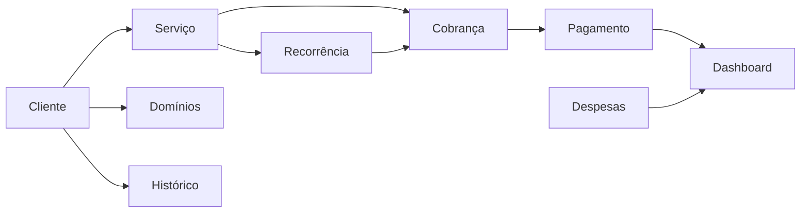
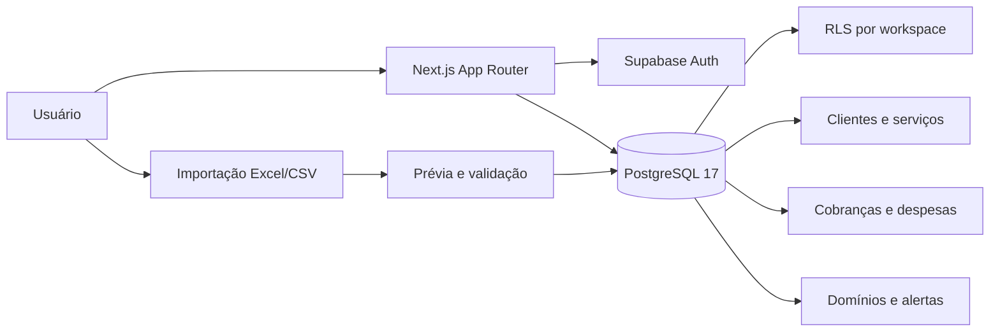

<div align="center">
  

# 💰 Fate Light

### Gestão leve para freelancers e pequenos negócios digitais.

  <p>
    Clientes, serviços, cobranças, despesas e domínios em um só lugar.<br />
    Feito para quem trabalha com projetos digitais e precisa ter clareza sobre a própria operação.
  </p>

  <p>
    <a href="https://github.com/RDEsley/Fate-Light/actions/workflows/ci.yml">
      
    </a>
    <a href="package.json">
      
    </a>
    <a href="https://nextjs.org/">
      
    </a>
    <a href="https://react.dev/">
      
    </a>
    <a href="https://www.typescriptlang.org/">
      
    </a>
    <a href="https://supabase.com/">
      
    </a>
    <a href="https://fatelight-alpha.vercel.app">
      
    </a>
    <a href="LICENSE">
      
    </a>
  </p>

  <p>
    <a href="https://fatelight-alpha.vercel.app"><strong>🌐 Abrir Fate Light</strong></a>
    &nbsp;•&nbsp;
    <a href="#-funcionalidades">Funcionalidades</a>
    &nbsp;•&nbsp;
    <a href="#-tecnologias">Tecnologias</a>
    &nbsp;•&nbsp;
    <a href="#-executando-localmente">Executar localmente</a>
  </p>
</div>

---

## ✨ Sobre o Fate Light

O **Fate Light** é um sistema de gestão financeira e operacional criado pela **Fate Eight Tech** para profissionais que trabalham com serviços digitais.

Ele nasceu de uma necessidade simples: organizar a rotina de quem cria sites, gerencia campanhas, mantém projetos recorrentes e precisa acompanhar clientes e dinheiro sem depender de várias planilhas.

### Feito especialmente para

* desenvolvedores e designers freelancers;
* profissionais que criam e mantêm sites;
* gestores de Google Ads e outras campanhas;
* pequenas agências;
* prestadores de serviços recorrentes;
* profissionais que ainda controlam a operação em planilhas.

O Fate Light não tenta substituir um sistema contábil. O objetivo é ser um **workspace simples para acompanhar a operação do dia a dia**.

---

## 🎯 O que ele resolve

Com o Fate Light, você consegue:

* acompanhar clientes e empresas/marcas vinculadas;
* cadastrar serviços únicos, parcelados ou recorrentes;
* saber quem precisa pagar e quando;
* registrar despesas da operação;
* controlar vencimentos de domínios;
* separar verba de mídia do faturamento real;
* receber alertas de cobranças e despesas próximas do vencimento;
* importar dados que antes estavam em planilhas;
* consultar o histórico financeiro de cada cliente.

Tudo fica ligado ao contexto certo, evitando clientes em uma planilha, domínios em outra, cobranças no WhatsApp e despesas esquecidas no cartão.

---

## 🖼️ Preview

<div align="center">
  
  <br /><br />
  
</div>

---

## 🚀 Funcionalidades

| Área              | Recursos                                                                               |
| ----------------- | -------------------------------------------------------------------------------------- |
| 📊 **Dashboard**  | Receitas, despesas, resultado, clientes ativos, empresas/marcas e próximos vencimentos |
| 👥 **Clientes**   | Cadastro, situação comercial, empresas/marcas, histórico, links e arquivamento         |
| 🧩 **Serviços**   | Serviços únicos ou recorrentes, parcelas, promoções, pausas, encerramento e reajustes  |
| 💳 **Cobranças**  | Vencimentos, pagamentos, recorrência automática e acompanhamento por cliente           |
| 🧾 **Despesas**   | Despesas avulsas ou recorrentes, categorias, clientes e comprovantes privados          |
| 🌐 **Domínios**   | Registro de domínios, registrador, vencimento e vínculo com clientes                   |
| 🔔 **Alertas**    | Cobranças e despesas atrasadas ou próximas do vencimento                               |
| 🕘 **Histórico**  | Linha do tempo pesquisável de pagamentos, atrasos, serviços e alterações               |
| 📥 **Importação** | Importação de Excel/CSV com prévia, validação e proteção contra duplicidade            |
| 🔐 **Conta**      | Autenticação, confirmação de e-mail, recuperação de senha, perfil e privacidade        |

---

## 💡 Pensado para a rotina de freelancers

Um projeto de site raramente termina apenas na entrega.

Depois aparecem:

* hospedagem;
* domínio;
* manutenção;
* alterações;
* tráfego pago;
* mensalidades;
* parcelas;
* novos serviços;
* despesas com ferramentas.

O Fate Light mantém tudo isso conectado ao cliente.

### Exemplo

Um cliente pode ter:

```text
Cliente
├── Site institucional
│   ├── 2 parcelas
│   └── manutenção mensal
├── Google Ads
│   ├── gestão mensal
│   └── verba de mídia
├── Domínio
│   └── vencimento anual
└── Histórico financeiro
```

Assim, a operação continua organizada mesmo quando a quantidade de clientes começa a crescer.

---

## 💰 Regra financeira central

O Fate Light separa **receita própria** de valores administrados em nome do cliente.

```text
Total bruto = receita própria + verba de mídia + adicionais

Resultado da empresa = receita própria recebida
                     + adicionais recebidos
                     - despesas pagas
```

A **verba de mídia não entra no faturamento da empresa**.

Isso evita, por exemplo, que R$ 2.000 recebidos para investimento em Google Ads apareçam como R$ 2.000 de receita do freelancer ou da agência.

---

## 🔄 Fluxo básico



Na prática:

1. Cadastre o cliente.
2. Aplique um serviço.
3. O Fate Light cria ou acompanha a cobrança.
4. Marque o pagamento quando ele acontecer.
5. Serviços recorrentes geram o próximo ciclo.
6. Dashboard, alertas e histórico são atualizados a partir desses dados.

---

## 🛠️ Tecnologias

<div align="center">


</div>

### Stack principal

* **Next.js 16** com App Router;
* **React 19**;
* **TypeScript 6** em modo estrito;
* **Tailwind CSS 4**;
* **Supabase Auth**;
* **PostgreSQL 17**;
* **Zod** para validação;
* **read-excel-file** para importação `.xlsx`;
* **Vitest + Testing Library**;
* **Playwright + Axe**;
* **pgTAP** para testes do banco;
* **ESLint**;
* **Vercel** para deploy.

---

## 🏗️ Arquitetura



Alguns princípios do projeto:

* Server Components por padrão;
* validação também no servidor;
* isolamento dos dados por `workspace_id`;
* RLS e `FORCE RLS` nas tabelas protegidas;
* FKs compostas para impedir relações entre workspaces;
* valores monetários em `numeric(15,2)`;
* importações confirmadas em uma única transação;
* nenhuma chave privilegiada exposta ao navegador.

---

## 📂 Estrutura

```text
.
├── docs/                     # Requisitos, arquitetura e decisões técnicas
├── scripts/                  # Segurança, tipos do banco e utilitários
├── src/
│   ├── app/                  # Rotas e App Router
│   ├── components/           # Componentes compartilhados
│   ├── config/               # Variáveis e contratos de ambiente
│   ├── features/             # Regras dos domínios funcionais
│   ├── lib/                  # Auth, Supabase e utilitários
│   ├── test/                 # Testes
│   └── types/                # Tipos gerados do PostgreSQL
└── supabase/
    ├── migrations/           # Migrations do banco
    ├── templates/            # Templates locais de autenticação
    └── tests/                # Testes pgTAP
```

---

## 💻 Executando localmente

### Pré-requisitos

* Node.js `24.18.1`;
* npm `11.16.0`;
* Git;
* Docker Desktop ou runtime compatível, caso queira executar o Supabase localmente.

### 1. Clone o projeto

```bash
git clone https://github.com/RDEsley/Fate-Light.git fate-light
cd fate-light
```

### 2. Instale as dependências

```bash
npm ci
```

### 3. Inicie o Supabase local

```bash
npm run supabase:start
npx supabase db reset --local
```

### 4. Configure o ambiente

Copie `.env.example` para `.env.local`:

```dotenv
NEXT_PUBLIC_APP_URL=http://localhost:3000
NEXT_PUBLIC_SUPABASE_URL=<URL local da API>
NEXT_PUBLIC_SUPABASE_PUBLISHABLE_KEY=<publishable key local>
NEXT_PUBLIC_TURNSTILE_SITE_KEY=
SUPABASE_SECRET_KEY=
```

> Nunca publique valores reais de `.env` ou a saída completa de `supabase status`.

### 5. Inicie a aplicação

```bash
npm run dev
```

A aplicação ficará disponível em:

```text
http://localhost:3000
```

Ambiente Supabase local:

```text
Studio:  http://127.0.0.1:54323
Mailpit: http://127.0.0.1:54324
```

---

## 🧪 Qualidade e testes

Principais verificações:

```bash
npm run lint
npm run typecheck
npm run test
npm run test:coverage
npm run build
npm run test:e2e
npm run security:check
```

Com o Supabase local:

```bash
npm run db:test
npm run db:types:check
npm run db:lint
npm run db:advisors:security
npm run test:e2e:auth
```

O projeto possui testes de aplicação, banco, acessibilidade e fluxo autenticado.

---

## 🔐 Segurança

O Fate Light foi estruturado para que o isolamento dos dados não dependa apenas da interface.

Entre as principais proteções estão:

* autenticação SSR;
* rotas privadas protegidas;
* RLS por workspace no PostgreSQL;
* validação com Zod e constraints no banco;
* scanner de segredos integrado ao fluxo de qualidade;
* importações processadas em memória;
* nenhuma chave privilegiada utilizada no navegador;
* confirmações reforçadas para operações destrutivas.

Para reportar vulnerabilidades, consulte [`SECURITY.md`](SECURITY.md).

**Não abra issues públicas contendo detalhes exploráveis de segurança.**

---

## ☁️ Deploy

O projeto está preparado para deploy na **Vercel**.

Produção atual:

👉 **https://fatelight-alpha.vercel.app**

As instruções completas estão em:

[`docs/deployment-vercel.md`](docs/deployment-vercel.md)

---

## 📍 Status do projeto

**Versão atual:** `0.8.2`

O Fate Light está em fase de preparação para a **V1**.

A aplicação principal já está funcional, incluindo clientes, serviços, cobranças, despesas, domínios, importação, autenticação, histórico e isolamento por workspace.

Antes do release definitivo, ainda existem verificações operacionais e configurações de produção previstas no checklist do projeto.

---

## ⚠️ Escopo atual

O Fate Light é uma ferramenta de gestão operacional e financeira para pequenos prestadores de serviço.

Ele **não é**:

* sistema contábil;
* ERP completo;
* gateway de pagamentos;
* emissor fiscal;
* sistema bancário.

Algumas automações também dependem da ação do usuário. Por exemplo, o próximo ciclo de uma cobrança recorrente é criado quando a cobrança atual é marcada como paga.

Esse escopo é intencional: manter o produto simples, previsível e útil para operações pequenas.

---

## 🤝 Contribuição

Contribuições são bem-vindas.

1. Crie uma branch a partir de `main`.
2. Faça mudanças pequenas e focadas.
3. Execute os testes e verificações de segurança.
4. Utilize Conventional Commits.
5. Abra um Pull Request descrevendo a alteração.

Não versione:

* `.env`;
* credenciais;
* builds;
* cobertura;
* relatórios temporários;
* dados privados.

---

## 📄 Licença

Distribuído sob a licença **MIT**.

Consulte [`LICENSE`](LICENSE) para mais informações.

---

## 👨‍💻 Desenvolvimento

<div align="center">
  <a href="https://github.com/RDEsley">
    
  </a>

### Richard Oliveira

**Desenvolvimento e arquitetura de software**

  <p>
    <a href="https://github.com/RDEsley">
      
    </a>
    <a href="mailto:richardesleyso@gmail.com">
      
    </a>
  </p>

Produto desenvolvido pela **Fate Eight Tech**.

</div>
