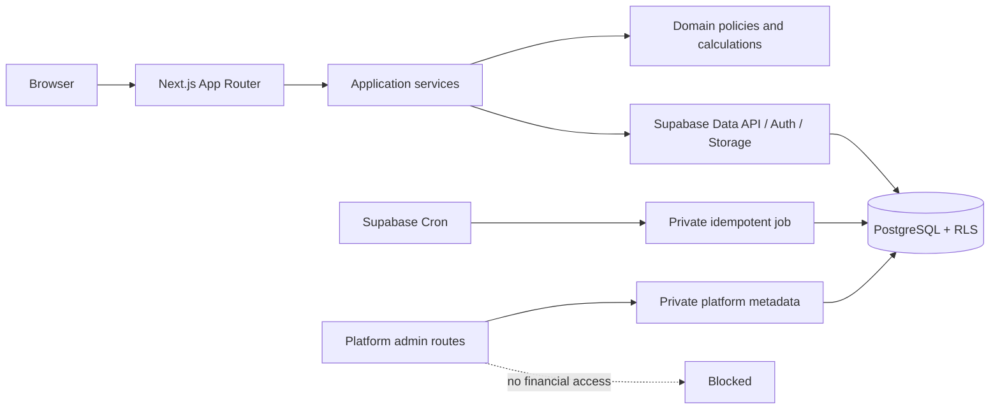

# Arquitetura

## 1. Estilo arquitetural

Aplicação modular em um único repositório e um único deploy web, com PostgreSQL como fonte de verdade. O desenho evita microserviços e abstrações genéricas prematuras, mas mantém limites claros entre interface, casos de uso, regras de domínio, persistência e integrações.



## 2. Stack planejada

- Next.js App Router e React.
- TypeScript estrito.
- Tailwind CSS e componentes acessíveis.
- Supabase Auth, PostgreSQL, Storage e Cron.
- Zod e React Hook Form.
- Vitest, Testing Library e Playwright.
- ESLint e Prettier.
- TanStack Query e biblioteca de gráficos somente quando o ganho justificar o custo.

Na Fase 2 serão fixadas versões estáveis e corrigidas. Em 2026-07-30, a linha recomendada é Next.js 16 Active LTS com o patch de segurança vigente; previews não entram no baseline.

## 3. Módulos

| Módulo | Responsabilidade |
|---|---|
| `auth` | cadastro, magic link, confirmação, sessão e suspensão |
| `profile` | preferências, avatar, sessões, exportação e exclusão |
| `workspace` | onboarding, identidade, moeda, timezone e ownership |
| `clients` | clientes, contatos, tags, histórico e visão consolidada |
| `services` | catálogo de serviços |
| `contracts` | contratos, itens, versões e agendas |
| `receivables` | cobranças, linhas, pagamentos e alocações |
| `expenses` | despesas, custos, fornecedores e pagamentos |
| `domains` | ativos, expiração e renovação |
| `alerts` | regras, geração, deduplicação e estados |
| `attachments` | metadados, validação e acesso ao Storage |
| `reporting` | consultas gerenciais, dashboard e exportações |
| `imports` | prévia, mapeamento, validação e confirmação |
| `audit` | eventos críticos e atividade |
| `platform` | metadados globais, suspensão e auditoria administrativa |

Cada módulo expõe casos de uso; componentes não calculam resultado, situação financeira, vigência ou rateio.

## 4. Organização de diretórios proposta

```text
src/
  app/
    (public)/
    (auth)/
    (workspace)/
    platform/
    api/
  components/
    ui/
    layout/
  features/
    auth/
    profile/
    workspace/
    clients/
    services/
    contracts/
    receivables/
    expenses/
    domains/
    alerts/
    attachments/
    reporting/
    imports/
    audit/
    platform/
  lib/
    supabase/
    money/
    dates/
    validation/
    errors/
  config/
  types/
  test/
supabase/
  migrations/
  tests/
  seed.sql
docs/
  adr/
.github/
  workflows/
```

Pastas só serão criadas quando tiverem conteúdo. Migrations, lockfile, seed fictício, `AGENTS.md` e documentação serão versionados.

## 5. Fluxo de requisição

1. Server Component carrega uma visão autorizada.
2. Formulário envia string, data civil e decimal string para Server Action/Route Handler.
3. Zod valida shape e limites.
4. Caso de uso verifica estado e regra de domínio.
5. Repositório executa operação atômica no Supabase/PostgreSQL.
6. RLS aplica o isolamento mesmo se o filtro de aplicação falhar.
7. A resposta mapeia `numeric` para decimal string e erros para um contrato público seguro.
8. Cache pertinente é revalidado; a UI anuncia o resultado.

Operações compostas, como pagamento + alocações, importação e geração recorrente, usam função/transação no banco com interface estreita. Funções privilegiadas são exceção: ficam em schema não exposto, definem `search_path`, validam o chamador e não concedem acesso genérico.

## 6. Autenticação e cadastro

- Supabase Auth com e-mail e senha ou magic link.
- Cliente SSR com cookies; confirmação troca `token_hash` por sessão em `/auth/confirm`.
- Identidade é obtida de claims verificadas pelo servidor, nunca de parâmetros do cliente.
- Mensagens de login/cadastro não confirmam existência de e-mail.
- CAPTCHA e limites de reenvio reduzem abuso.
- Aceite legal é registrado após usuário confirmado.
- Onboarding cria workspace e membership de owner em operação atômica.
- Conta suspensa perde acesso antes de qualquer caso de uso.

O cliente web usa apenas URL e chave publicável. Chave secreta fica somente no ambiente servidor e não substitui RLS em fluxos de usuário.

## 7. Multi-tenancy e autorização

- Toda entidade de negócio contém `workspace_id uuid not null`.
- `workspace_memberships` é a fonte de autorização do workspace.
- No MVP, apenas `role = 'owner'` e `status = 'active'` são válidos.
- Policies separam `select`, `insert`, `update` e `delete`, com `USING` e `WITH CHECK`.
- Consultas de membership usam `(select auth.uid())` e índices em `workspace_id`, `user_id` e filtros de status.
- O cliente não envia um `workspace_id` arbitrário sem validação; o servidor o resolve da sessão.
- Testes usam dois usuários/workspaces e tentam leitura, inserção, alteração, exclusão e Storage cruzados.

Detalhes: [ADR 0002](adr/0002-multi-tenant.md).

## 8. Administrador global

`private.platform_admins` e a auditoria administrativa ficam fora das tabelas de membership. A aplicação de plataforma:

- valida autorização global no servidor;
- retorna somente metadados permitidos;
- não usa impersonation;
- não possui consultas a tabelas financeiras;
- não consegue assinar URLs de anexos de workspace;
- registra motivo e ator para suspensão, reativação e apoio ao ciclo de conta.

Se houver uma investigação que exija conteúdo privado no futuro, ela precisará de novo ADR, consentimento/processo legal e autorização temporária auditada.

## 9. Storage

Buckets privados:

- `workspace-documents`: PDF, JPEG, PNG e WebP, até 4 MB por upload via Server Action. O limite
  reserva a sobrecarga do formulário dentro do payload máximo de 4,5 MB da Vercel.
- `profile-avatars`: JPEG, PNG e WebP, até 2 MB.

Estrutura de objeto:

```text
workspace-documents/{workspace_id}/fiscal/{charge|expense}/{entity_id}/{document_id}/{safe_filename}
profile-avatars/{user_id}/{attachment_id}/{safe_filename}
```

Regras:

- RLS em `storage.objects` valida o primeiro segmento e o vínculo da entidade.
- A UI não define caminho confiável; o servidor emite o destino validado.
- Extensão, MIME declarado, assinatura do arquivo e tamanho precisam concordar.
- SVG, HTML, executáveis, macros e arquivos compactados ficam fora do MVP.
- Download usa autorização ou URL assinada com validade de 5 minutos.
- Remoção individual apaga primeiro o objeto e só então os metadados, permitindo nova tentativa se o
  banco falhar. A limpeza total é transacional no banco e remove do Storage os caminhos devolvidos.

## 10. Dinheiro e serialização

- Banco: valores monetários em `numeric(15,2)`, quantidades em `numeric(12,4)` e taxas em `numeric(7,4)`.
- Entrada/saída web: string decimal canônica, nunca `float`, `Number`, `parseFloat` ou coerção implícita.
- Read models/RPCs expõem dinheiro como texto; componentes não recebem `numeric` bruto.
- O repositório usa uma biblioteca decimal avaliada e fixada na Fase 2.
- Arredondamento: `ROUND_HALF_UP`/metade afastada de zero, por linha, para duas casas; soma ocorre depois.
- Alocações distribuem o resíduo de centavos de forma determinística e auditável.

Detalhes: [ADR 0005](adr/0005-money-and-rounding.md).

## 11. Datas e timezone

- `date`: vencimento, competência, início, fim, renovação e expiração.
- `timestamptz`: criação, atualização, auditoria, confirmação de pagamento e ação do usuário.
- Banco armazena instantes em UTC.
- `date` trafega como `YYYY-MM-DD` e nunca passa por `new Date('YYYY-MM-DD')`.
- O timezone IANA do workspace determina “hoje”, atraso, competência local e execução de agendas.
- A apresentação converte timestamps para o timezone do workspace ou do perfil, conforme o contexto.

Detalhes: [ADR 0006](adr/0006-dates-and-timezone.md).

## 12. Recorrência

Supabase Cron executará periodicamente uma função interna. A função:

1. calcula o dia local de cada workspace;
2. seleciona agendas vencidas;
3. tenta inserir `(billing_schedule_id, period_start)` único;
4. cria cobrança e linhas em transação;
5. avança a próxima execução;
6. registra resultado técnico sem conteúdo financeiro em logs.

Execução oportunista pode apenas solicitar reparo; nunca é a fonte primária. Edge Function fica reservada a orquestração externa; Vercel Cron não será a agenda canônica.

Detalhes: [ADR 0007](adr/0007-recurrence-and-idempotency.md).

## 13. Consultas, índices e desempenho

- Toda FK usada em join recebe índice.
- Índices compostos começam por `workspace_id`, seguido por igualdade/status e por último datas de faixa.
- Índices parciais cobrem registros abertos, ativos e não arquivados.
- Queries de dashboard usam read models SQL, não agregação no navegador.
- Listagens usam paginação e filtros no servidor.
- `EXPLAIN (ANALYZE, BUFFERS)` e Supabase Advisors entram nos gates após existirem migrations.

Índices propostos estão em [data-model.md](data-model.md).

## 14. Erros e observabilidade

- Erros públicos têm código estável, mensagem compreensível e `correlation_id`.
- Logs técnicos não incluem tokens, cookies, nomes de arquivo originais, documentos, e-mails completos ou valores financeiros.
- Falhas esperadas de regra de negócio não são exceções genéricas.
- Operações idempotentes retornam o recurso já criado quando a repetição é válida.
- Ações críticas registram auditoria independente do log técnico.

## 15. Segurança de entrega

- `.env.example` possui somente placeholders.
- Segredos ficam no ambiente local ignorado e nos cofres das plataformas.
- CI usa instalação reproduzível, lint, typecheck, testes, build, secret scanning e análise de dependências.
- Dependabot/Renovate é avaliado na Fase 2.
- O workflow não imprime endpoints privados ou respostas autenticadas.
- A planilha real permanece em `private/`, fora do Git.

## 16. Referências oficiais verificadas

- [Supabase Row Level Security](https://supabase.com/docs/guides/database/postgres/row-level-security)
- [Supabase Storage buckets](https://supabase.com/docs/guides/storage/buckets/fundamentals)
- [Supabase Cron](https://supabase.com/docs/guides/cron)
- [Supabase SSR client](https://supabase.com/docs/guides/auth/server-side/creating-a-client)
- [Supabase publishable and secret keys](https://supabase.com/docs/guides/getting-started/migrating-to-new-api-keys)
- [PostgreSQL data types](https://www.postgresql.org/docs/current/datatype.html)
- [PostgreSQL constraints](https://www.postgresql.org/docs/current/ddl-constraints.html)
