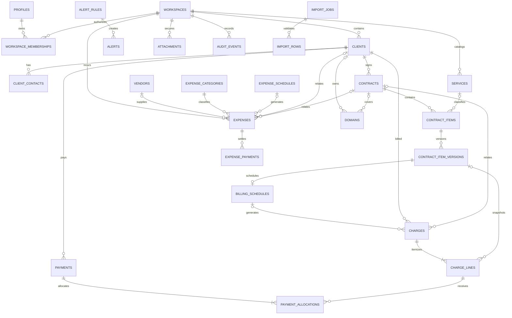

# Modelo de dados

## 1. Convenções globais

### Identificadores

- Entidades principais usam `uuid primary key default gen_random_uuid()`.
- A geração acontece no PostgreSQL e segue UUID v4 em todo o MVP.
- UUIDs podem aparecer em URLs autenticadas, mas autorização nunca depende de serem difíceis de adivinhar.
- IDs sequenciais não são expostos e não serão usados como chave pública.
- A adoção futura de UUID v7 só ocorrerá após suporte nativo/operacional comprovado e migration específica.

### Tipos

- Texto: `text`; limites de negócio são `check (char_length(...))`.
- Dinheiro: `numeric(15,2)`.
- Quantidade: `numeric(12,4)`.
- Percentual/taxa: `numeric(7,4)`.
- Data civil: `date`.
- Evento/instante: `timestamptz`.
- Moeda: `text` com `check` de três letras maiúsculas; uma moeda por workspace.
- Estados e naturezas: `text` com `check`, evitando rigidez de enum PostgreSQL no MVP.

### Colunas comuns

Tabelas mutáveis de negócio contêm:

```text
id uuid
workspace_id uuid
created_at timestamptz
updated_at timestamptz
created_by uuid
updated_by uuid
archived_at timestamptz, quando arquivamento for permitido
```

`created_by` e `updated_by` referenciam logicamente `auth.users(id)`; a implementação decidirá entre FK direta suportada e validação controlada, sem replicar e-mail ou identidade em cada tabela.

### Multi-tenancy

- Toda entidade financeira/operacional tem `workspace_id not null`.
- FKs entre entidades de negócio devem ser compostas ou validadas para impedir referência cruzada de workspace.
- RLS exige membership ativa e `role = 'owner'`.
- Policies de leitura e escrita são separadas.
- Toda coluna usada por RLS ou FK recebe índice.

### Arquivamento

- Cadastros mestres podem ser arquivados.
- Movimentos financeiros confirmados não são arquivados nem apagados; recebem cancelamento, ajuste ou reembolso.
- Eventos e versões imutáveis são retidos conforme política futura de retenção.

## 2. Naturezas financeiras

### Linhas de cobrança

| Valor | Significado | Entra em receita/resultado? |
|---|---|---|
| `company_revenue` | Valor pertencente à empresa | Sim |
| `managed_media` | Verba administrada para mídia | Não |
| `pass_through` | Valor recebido para repasse/reembolso | Não |

### Despesas

| Valor | Significado | Entra em resultado? |
|---|---|---|
| `operating_expense` | Despesa geral da operação | Sim |
| `direct_cost` | Custo diretamente ligado a cliente/contrato/serviço | Sim |
| `managed_media_spend` | Aplicação da verba administrada | Não |
| `pass_through_disbursement` | Saída correspondente a repasse | Não |

Uma linha possui exatamente uma natureza. Não existe linha “mista”.

## 3. Entidades de identidade e plataforma

### `profiles`

| Aspecto | Definição |
|---|---|
| Finalidade | Preferências e dados de apresentação do usuário autenticado. |
| Campos | `id uuid` (= usuário Auth), `full_name text`, `phone text null`, `locale text`, `timezone text`, `theme text`, `account_status text`, `last_seen_at timestamptz null`, `created_at`, `updated_at`. |
| FKs/constraints | `id` vinculado a `auth.users`; timezone IANA válida; `theme` e `account_status` em valores aceitos. |
| Índices | PK `id`; nenhum índice pessoal adicional no MVP. |
| Arquivamento/histórico | Sem `archived_at`; remoção segue ciclo de conta. Alterações relevantes em auditoria. |
| Workspace/RLS | Não tem `workspace_id`; usuário ativo lê somente o próprio perfil e atualiza apenas campos permitidos por grants de coluna. Suspensão bloqueia acesso. |
| Derivado/não armazenar | E-mail e sessão vêm do Auth; não armazenar senha, claims, tokens, avatar nesta fase ou lista de workspaces. |

### `workspaces`

| Aspecto | Definição |
|---|---|
| Finalidade | Limite de tenant; configurações empresariais ficam em `workspace_settings`. |
| Campos | `id`, `name`, `status`, `currency`, `timezone`, `created_by`, `created_at`, `updated_at`, `archived_at null`. |
| FKs/constraints | Nome obrigatório; moeda de três letras maiúsculas; timezone IANA; status válido; `unique(created_by)` materializa um workspace por usuário no MVP. |
| Índices | PK e unicidade de `created_by`. Acesso usa índices em `workspace_members`; status isolado não recebe índice de baixa seletividade. |
| Arquivamento/histórico | Ciclo por status; sem exclusão direta. Mudança de moeda bloqueada após primeiro movimento. |
| Workspace/RLS | `id` é o limite do tenant; a tabela não repete `workspace_id`. Owner ativo lê/edita. Suspensão bloqueia operações. |
| Derivado/não armazenar | Não armazenar saldo, receita, lucro, número de clientes ou “plano”. Tudo é consulta derivada. |

### `workspace_members`

| Aspecto | Definição |
|---|---|
| Finalidade | Fonte de autorização entre usuário e workspace. |
| Campos | `workspace_id`, `user_id`, `role`, `status`, `joined_at`, `created_at`, `updated_at`. |
| FKs/constraints | PK `(workspace_id,user_id)`; `unique(user_id)`; no MVP `role = 'owner'`; índice único parcial limita um owner ativo. A criação transacional garante sua existência. |
| Índices | PK composta, usuário único e lookup parcial de owner ativo. |
| Arquivamento/histórico | Não arquivar; alterar status e auditar. Convites não existem no MVP. |
| Workspace/RLS | Usuário lê sua membership; criação inicial por caso de uso atômico; nenhuma tela de administração de membros. |
| Derivado/não armazenar | Não armazenar permissões granulares. |

### `workspace_settings`

| Aspecto | Definição |
|---|---|
| Finalidade | Preferências empresariais ligadas um-para-um ao workspace. |
| Campos | `workspace_id`, `legal_name`, `trade_name null`, `tax_id null`, endereço em colunas estruturadas, `country_code`, `date_format`, `accounting_basis`, `default_alert_offsets smallint[]`, `general_settings jsonb`, timestamps. |
| FKs/constraints | PK/FK para workspace; CPF/CNPJ canônico opcional; formatos e base contábil em allowlist; offsets únicos entre 0 e 365; JSON deve ser objeto limitado a 8 KiB. |
| Índices | PK `workspace_id`, suficiente para FK e policies desta fase. |
| Arquivamento/histórico | Segue o ciclo do workspace; campos de ownership são imutáveis pelo cliente. |
| Workspace/RLS | Owner ativo lê e atualiza somente colunas empresariais concedidas. Suspensão de usuário, membership ou workspace bloqueia acesso. |
| Derivado/não armazenar | Moeda e timezone canônicos permanecem no workspace; JSON não armazena autorização nem campos consultados com frequência. |

### `legal_documents`

| Aspecto | Definição |
|---|---|
| Finalidade | Versionar Termos e Política de Privacidade. |
| Campos | `id`, `document_type`, `version`, `content_markdown`, `content_hash`, `published_at`, `effective_at`, `retired_at null`, `status`, `is_required`, timestamps. |
| FKs/constraints | `unique(document_type,version)`; um publicado por tipo; SHA-256 deve corresponder ao conteúdo; estado e datas coerentes. |
| Índices | Versão única, um publicado por tipo e lookup parcial de documento obrigatório vigente. |
| Arquivamento/histórico | Versões nunca sobrescritas; `retired_at` encerra vigência. |
| Workspace/RLS | Sem workspace; nesta fase somente usuário autenticado não suspenso lê versões publicadas e vigentes. `anon` não recebe grant. |
| Derivado/não armazenar | O seed contém apenas placeholders fictícios; conteúdo legal definitivo exige revisão e nova versão. |

### `legal_acceptances`

| Aspecto | Definição |
|---|---|
| Finalidade | Provar qual versão foi aceita por qual usuário. |
| Campos | `id`, `user_id`, `legal_document_id`, `document_version`, `accepted_at`, `source`, `created_at`. |
| FKs/constraints | FK composta preserva documento/versão; `unique(user_id,legal_document_id)`; insert-only para o cliente. |
| Índices | `(user_id,accepted_at desc)`. |
| Arquivamento/histórico | Imutável; retenção conforme obrigação legal. |
| Workspace/RLS | Sem workspace; usuário ativo lê os próprios aceites; inserção ocorre somente pelo bootstrap privado. |
| Derivado/não armazenar | IP e user-agent não são coletados sem necessidade documentada; não armazenar checkbox como booleano mutável. |

### `private.platform_admins`

| Aspecto | Definição |
|---|---|
| Finalidade | Autorizar administradores globais separadamente dos workspaces. |
| Campos | `user_id`, `status`, `granted_at`, `granted_by`, `revoked_at null`, `reason`. |
| FKs/constraints | Usuário único; status em `active/revoked`; concessão/revogação controlada. |
| Índices | PK `user_id`, parcial para ativos. |
| Arquivamento/histórico | Revogação preservada; concessões auditadas. |
| Workspace/RLS | Sem workspace; schema não exposto ao Data API; não cria membership nem bypass financeiro. |
| Derivado/não armazenar | Não usar `user_metadata`, lista hardcoded, e-mail ou variável pública para autorização. |

### `private.platform_admin_audit_events`

| Aspecto | Definição |
|---|---|
| Finalidade | Trilha imutável de ações globais. |
| Campos | `id`, `actor_user_id`, `action`, `target_type`, `target_id`, `reason`, `metadata_json`, `occurred_at`, `correlation_id`. |
| FKs/constraints | Ação e motivo obrigatórios; insert-only; metadata sem conteúdo financeiro. |
| Índices | `(occurred_at desc)`, `(target_type,target_id,occurred_at desc)`, `(actor_user_id,occurred_at desc)`. |
| Arquivamento/histórico | Imutável, sem `updated_at`/`archived_at`. |
| Workspace/RLS | Privado e separado; acesso somente pela superfície de plataforma. |
| Derivado/não armazenar | Não armazenar tokens, anexos, payloads de clientes ou snapshots financeiros. |

### `private.account_lifecycle_requests`

| Aspecto | Definição |
|---|---|
| Finalidade | Orquestrar exportação e exclusão de conta/workspace com estado verificável. |
| Campos | `id`, `user_id`, `workspace_id null`, `request_type`, `status`, `requested_at`, `verified_at null`, `scheduled_for null`, `completed_at null`, `artifact_expires_at null`, `correlation_id`, `error_code null`. |
| FKs/constraints | Tipo em `export/deletion`; transições de estado permitidas; no máximo uma solicitação ativa por usuário/tipo. |
| Índices | `(user_id,requested_at desc)`, parcial por solicitações ativas, `(scheduled_for)` para jobs. |
| Arquivamento/histórico | Estado preservado conforme retenção; transições administrativas auditadas. |
| Workspace/RLS | Schema privado; usuário consulta uma visão sanitizada somente dos próprios pedidos; global admin opera sem receber conteúdo financeiro. |
| Derivado/não armazenar | Artefato de exportação fica em Storage privado e expira; não guardar download URL, senha ou payload exportado na linha. |

## 4. Cadastros operacionais

### `clients`

| Aspecto | Definição |
|---|---|
| Finalidade | Representar pessoa/empresa atendida. |
| Campos | comuns + `kind`, `name`, `trade_name null`, `tax_id null`, `address_json null`, `commercial_status`, `notes null`, `tags text[]`, `responsible_name null`. |
| FKs/constraints | `kind` em `person/company`; status comercial permitido; nome obrigatório; `unique(workspace_id,id)` para FKs compostas. |
| Índices | `(workspace_id,commercial_status) where archived_at is null`, `(workspace_id,lower(name))`, GIN opcional em tags. |
| Arquivamento/histórico | `archived_at`; arquivar não altera movimentos. Alteração de documento/status é auditada. |
| Workspace/RLS | Owner do mesmo workspace. |
| Derivado/não armazenar | Situação financeira, saldo, receita e atraso não são colunas; são derivados de cobranças/pagamentos. |

### `client_contacts`

| Aspecto | Definição |
|---|---|
| Finalidade | Manter múltiplos contatos por cliente. |
| Campos | comuns + `client_id`, `name`, `email null`, `phone null`, `role null`, `is_primary`. |
| FKs/constraints | FK composta cliente/workspace; ao menos e-mail ou telefone; no máximo um principal ativo por cliente. |
| Índices | `(workspace_id,client_id)`, único parcial para contato principal não arquivado. |
| Arquivamento/histórico | `archived_at`; alterações auditáveis quando relevantes. |
| Workspace/RLS | Owner do mesmo workspace. |
| Derivado/não armazenar | Não copiar contato para contrato; cobranças podem guardar snapshot de destinatário apenas se necessário. |

### `services`

| Aspecto | Definição |
|---|---|
| Finalidade | Catálogo reutilizável de serviços. |
| Campos | comuns + `name`, `description null`, `default_component_kind`, `default_financial_nature`, `active`. |
| FKs/constraints | Nome único entre ativos no workspace; natureza válida. |
| Índices | `(workspace_id,active,name)`. |
| Arquivamento/histórico | `archived_at`; contratos preservam snapshots em versões. |
| Workspace/RLS | Owner do mesmo workspace. |
| Derivado/não armazenar | Não armazenar preço vigente como verdade do contrato; preço fica na versão do item. |

### `vendors`

| Aspecto | Definição |
|---|---|
| Finalidade | Fornecedor ou favorecido de despesa. |
| Campos | comuns + `name`, `tax_id null`, `contact_json null`, `notes null`. |
| FKs/constraints | Nome obrigatório; unicidade flexível por workspace. |
| Índices | `(workspace_id,lower(name)) where archived_at is null`. |
| Arquivamento/histórico | `archived_at`; despesas mantêm FK. |
| Workspace/RLS | Owner do mesmo workspace. |
| Derivado/não armazenar | Não armazenar total gasto ou saldo. |

### `expense_categories`

| Aspecto | Definição |
|---|---|
| Finalidade | Classificar despesas sem criar plano de contas contábil. |
| Campos | comuns + `name`, `default_nature`, `color null`, `active`. |
| FKs/constraints | `unique(workspace_id,name)` entre ativas; natureza permitida. |
| Índices | `(workspace_id,active,name)`. |
| Arquivamento/histórico | `archived_at`; uso histórico preservado. |
| Workspace/RLS | Owner do mesmo workspace. |
| Derivado/não armazenar | Não criar hierarquia ou códigos contábeis no MVP. |

## 5. Contratos e recorrência

### `contracts`

| Aspecto | Definição |
|---|---|
| Finalidade | Acordo comercial com um cliente. |
| Campos | comuns + `client_id`, `title`, `status`, `start_date`, `end_date null`, `renewal_on null`, `auto_renew`, `owner_label null`, `notes null`. |
| FKs/constraints | FK composta cliente/workspace; datas coerentes; status em `draft/active/paused/cancelled/completed`. |
| Índices | `(workspace_id,client_id,status)`, `(workspace_id,renewal_on) where status='active'`. |
| Arquivamento/histórico | `archived_at` apenas para draft/completed; transições críticas auditadas. |
| Workspace/RLS | Owner do mesmo workspace. |
| Derivado/não armazenar | Valor total, receita e “próxima cobrança” não ficam no contrato. |

### `contract_items`

| Aspecto | Definição |
|---|---|
| Finalidade | Identidade estável de cada serviço/adicional do contrato. |
| Campos | comuns + `contract_id`, `service_id null`, `status`, `current_version_number`. |
| FKs/constraints | FKs compostas; status em `active/paused/cancelled/completed`; versão >= 1. |
| Índices | `(workspace_id,contract_id,status)`, `(workspace_id,service_id)`. |
| Arquivamento/histórico | `archived_at` só quando nunca faturado ou concluído; versões preservam histórico. |
| Workspace/RLS | Owner do mesmo workspace. |
| Derivado/não armazenar | Descrição, preço, natureza e periodicidade ficam nas versões, não duplicados aqui. |

### `contract_item_versions`

| Aspecto | Definição |
|---|---|
| Finalidade | Snapshot imutável das condições de um item por vigência. |
| Campos | `id`, `workspace_id`, `contract_item_id`, `version_number`, `effective_from`, `effective_to null`, `description`, `component_kind`, `financial_nature`, `billing_type`, `quantity`, `unit_amount`, `discount_amount`, `estimated_direct_cost`, `notes null`, `created_at`, `created_by`, `change_reason`. |
| FKs/constraints | FK composta item/workspace; `unique(contract_item_id,version_number)`; vigências sem sobreposição; valores não negativos; `billing_type` em `one_time/recurring`. |
| Índices | `(workspace_id,contract_item_id,effective_from desc)`, exclusão/constraint para sobreposição de vigência. |
| Arquivamento/histórico | Imutável, sem `updated_at`/`archived_at`; nova condição cria nova versão. |
| Workspace/RLS | Owner do mesmo workspace; insert por caso de uso que encerra versão anterior. |
| Derivado/não armazenar | Total da linha = arredondamento de quantidade × valor - desconto; não armazenar margem nem cobranças futuras. |

### `billing_schedules`

| Aspecto | Definição |
|---|---|
| Finalidade | Agenda recorrente associada a uma versão de item. |
| Campos | comuns + `contract_item_version_id`, `frequency_unit`, `frequency_interval`, `billing_day null`, `start_on`, `end_on null`, `next_run_on`, `status`, `last_generated_period_start null`. |
| FKs/constraints | FK composta versão/workspace; intervalo > 0; dia compatível; datas coerentes; uma agenda ativa por versão. |
| Índices | `(workspace_id,next_run_on) where status='active'`, `(workspace_id,contract_item_version_id)`. |
| Arquivamento/histórico | Encerrar com status/data; não apagar após gerar cobrança. Mudanças de regra criam nova agenda. |
| Workspace/RLS | Owner lê/gerencia; job interno escreve por função estreita. |
| Derivado/não armazenar | Próximos períodos além de `next_run_on` são calculados; não pré-criar infinitas cobranças. |

### `private.billing_generation_runs`

| Aspecto | Definição |
|---|---|
| Finalidade | Controlar execução e diagnóstico de recorrência. |
| Campos | `id`, `billing_schedule_id`, `workspace_id`, `period_start`, `generation_key`, `status`, `attempt_count`, `charge_id null`, `started_at`, `finished_at null`, `error_code null`, `correlation_id`. |
| FKs/constraints | `unique(billing_schedule_id,period_start)` e `unique(generation_key)`; status técnico permitido. |
| Índices | `(status,started_at)`, `(workspace_id,period_start)`. |
| Arquivamento/histórico | Registro técnico retido por prazo; tentativas críticas geram evento. |
| Workspace/RLS | Schema privado; sem acesso direto do cliente. |
| Derivado/não armazenar | Não armazenar valores, nomes ou stack traces com dados; detalhes vêm de logs protegidos. |

### `expense_schedules`

| Aspecto | Definição |
|---|---|
| Finalidade | Agenda de despesas fixas/recorrentes, separada de agendas de cobrança. |
| Campos | comuns + `vendor_id null`, `category_id`, `expense_nature`, `description`, `amount`, `currency`, `frequency_unit`, `frequency_interval`, `billing_day null`, `start_on`, `end_on null`, `next_run_on`, `client_id null`, `contract_id null`, `contract_item_id null`, `status`. |
| FKs/constraints | FKs no mesmo workspace; valor > 0; intervalo > 0; datas coerentes; moeda do workspace; uma natureza explícita. |
| Índices | `(workspace_id,next_run_on) where status='active'`, `(workspace_id,category_id,status)`. |
| Arquivamento/histórico | Encerrar a agenda sem apagar despesas já geradas; mudança material cria nova agenda. |
| Workspace/RLS | Owner lê/gerencia; job interno gera despesas por operação idempotente. |
| Derivado/não armazenar | Próximas ocorrências além de `next_run_on` são calculadas; não armazenar total anual ou impacto em resultado. |

## 6. Cobranças e recebimentos

### `charges`

| Aspecto | Definição |
|---|---|
| Finalidade | Documento gerencial de valor a receber. |
| Campos | comuns + `client_id`, `contract_id null`, `billing_schedule_id null`, `period_start null`, `period_end null`, `generation_key null`, `issued_on`, `due_on`, `competence_on`, `status`, `invoice_issued`, `cancelled_at null`, `cancel_reason null`, `notes null`. |
| FKs/constraints | FKs no mesmo workspace; período coerente; `unique(billing_schedule_id,period_start)` quando recorrente; generation key única; cancelamento exige motivo. |
| Índices | `(workspace_id,due_on,status)`, `(workspace_id,client_id,status)`, parcial para cobranças abertas. |
| Arquivamento/histórico | Draft pode ser removido antes de uso; emitida é preservada e cancelável. Alterações críticas auditadas. |
| Workspace/RLS | Owner do mesmo workspace. |
| Derivado/não armazenar | Total bruto, total próprio, mídia, repasse, pago, saldo e situação são somas das linhas/alocações. |

### `charge_lines`

| Aspecto | Definição |
|---|---|
| Finalidade | Snapshot monetário e semântico de cada componente cobrado. |
| Campos | `id`, `workspace_id`, `charge_id`, `source_contract_item_version_id null`, `description`, `component_kind`, `financial_nature`, `quantity`, `unit_amount`, `discount_amount`, `line_amount`, `competence_on`, `created_at`, `created_by`. |
| FKs/constraints | FKs no mesmo workspace; valores não negativos; `line_amount` deve reconciliar com regra de arredondamento; pelo menos uma linha por cobrança emitida. |
| Índices | `(workspace_id,charge_id)`, `(workspace_id,financial_nature,competence_on)`, `(source_contract_item_version_id)`. |
| Arquivamento/histórico | Imutável após emissão; correção exige cancelar/substituir cobrança. |
| Workspace/RLS | Owner do mesmo workspace. |
| Derivado/não armazenar | Saldo/pago/resultados não são colunas. `line_amount` é snapshot calculado e validado, não entrada livre. |

### `payments`

| Aspecto | Definição |
|---|---|
| Finalidade | Entrada financeira confirmada. |
| Campos | `id`, `workspace_id`, `client_id`, `amount`, `currency`, `payment_method`, `reference null`, `confirmed_at`, `status`, `cancelled_at null`, `cancel_reason null`, `notes null`, `created_at`, `created_by`. |
| FKs/constraints | Cliente no mesmo workspace; valor > 0; moeda do workspace; status em `confirmed/cancelled/refunded`; cancelamento exige motivo. |
| Índices | `(workspace_id,confirmed_at desc)`, `(workspace_id,client_id,confirmed_at desc)`. |
| Arquivamento/histórico | Imutável após confirmação, exceto transição auditada de cancelamento/reembolso. |
| Workspace/RLS | Owner do mesmo workspace; confirmação por operação transacional. |
| Derivado/não armazenar | Natureza e cobrança paga vêm das alocações; não armazenar “receita” no pagamento. |

### `payment_allocations`

| Aspecto | Definição |
|---|---|
| Finalidade | Destinar cada parte do pagamento a uma linha de cobrança. |
| Campos | `id`, `workspace_id`, `payment_id`, `charge_line_id`, `amount`, `created_at`, `created_by`. |
| FKs/constraints | FKs no mesmo workspace/cliente; `amount > 0`; `unique(payment_id,charge_line_id)`; somas não excedem pagamento nem saldo da linha; soma por pagamento deve igualar pagamento confirmado. |
| Índices | `(workspace_id,payment_id)`, `(workspace_id,charge_line_id)`. |
| Arquivamento/histórico | Imutável; cancelamento do pagamento invalida por estado do pai, sem apagar alocações. |
| Workspace/RLS | Owner do mesmo workspace; escrita apenas na operação atômica de confirmação. |
| Derivado/não armazenar | Não duplicar natureza: ela vem de `charge_lines.financial_nature`. |

As invariantes de soma são validadas na mesma transação por função/trigger diferível. Não basta validação no navegador.

## 7. Despesas e pagamentos

### `expenses`

| Aspecto | Definição |
|---|---|
| Finalidade | Obrigação ou saída operacional com natureza explícita. |
| Campos | comuns + `expense_schedule_id null`, `period_start null`, `generation_key null`, `vendor_id null`, `category_id`, `expense_nature`, `description`, `amount`, `currency`, `competence_on`, `due_on`, `client_id null`, `contract_id null`, `contract_item_id null`, `cost_center null`, `status`, `notes null`, `cancelled_at null`. |
| FKs/constraints | Todas FKs no workspace; valor > 0; moeda do workspace; `unique(expense_schedule_id,period_start)` quando recorrente; generation key única; gasto de mídia requer vínculo justificável; cancelamento exige motivo. |
| Índices | `(workspace_id,due_on,status)`, `(workspace_id,competence_on,expense_nature)`, `(workspace_id,client_id)`, `(workspace_id,contract_id)`, parcial para abertas. |
| Arquivamento/histórico | Draft pode ser arquivado; confirmada é cancelável, não apagável. Alteração de natureza/valor é auditada. |
| Workspace/RLS | Owner do mesmo workspace. |
| Derivado/não armazenar | Pago, saldo, atraso, impacto em resultado e margem são derivados. |

### `expense_payments`

| Aspecto | Definição |
|---|---|
| Finalidade | Registrar pagamento total ou parcial de uma despesa. |
| Campos | `id`, `workspace_id`, `expense_id`, `amount`, `currency`, `payment_method`, `confirmed_at`, `reference null`, `status`, `cancelled_at null`, `cancel_reason null`, `created_at`, `created_by`. |
| FKs/constraints | Despesa no mesmo workspace; valor > 0; soma confirmada não excede despesa; moeda igual. |
| Índices | `(workspace_id,expense_id,confirmed_at)`, `(workspace_id,confirmed_at desc)`. |
| Arquivamento/histórico | Imutável após confirmação, salvo cancelamento/reembolso auditado. |
| Workspace/RLS | Owner do mesmo workspace. |
| Derivado/não armazenar | Natureza vem da despesa; não duplicar impacto de resultado. |

## 8. Domínios, alertas e anexos

### `domains`

| Aspecto | Definição |
|---|---|
| Finalidade | Controlar domínio e renovação sem guardar credenciais. |
| Campos | comuns + `client_id null`, `contract_id null`, `contract_item_id null`, `domain_name`, `registrar`, `legal_owner null`, `registrar_email null`, `registered_on null`, `expires_on`, `auto_renew`, `renewal_cost null`, `payment_responsible null`, `status`, `admin_url null`, `notes null`. |
| FKs/constraints | FKs no workspace; domínio normalizado e único entre ativos; URL HTTPS quando presente; custo >= 0. |
| Índices | `(workspace_id,expires_on) where archived_at is null`, `(workspace_id,status)`. |
| Arquivamento/histórico | `archived_at`; alterações de expiração/renovação auditadas. |
| Workspace/RLS | Owner do mesmo workspace. |
| Derivado/não armazenar | Dias restantes e severidade são derivados; nunca armazenar senha, token ou código de recuperação. |

### `alert_rules`

| Aspecto | Definição |
|---|---|
| Finalidade | Configurar antecedência e severidade por origem. |
| Campos | comuns + `source_type`, `offset_days`, `severity`, `enabled`, `scope_entity_id null`. |
| FKs/constraints | `offset_days >= 0`; unicidade por workspace/origem/offset/escopo. |
| Índices | `(workspace_id,source_type,enabled)`. |
| Arquivamento/histórico | Desativar em vez de apagar quando já gerou alertas. |
| Workspace/RLS | Owner do mesmo workspace. |
| Derivado/não armazenar | Próxima execução e quantidade de alertas não são armazenadas. |

### `alerts`

| Aspecto | Definição |
|---|---|
| Finalidade | Instância acionável de atenção. |
| Campos | comuns + `alert_rule_id null`, `source_type`, `source_id`, `milestone_on`, `deduplication_key`, `severity`, `state`, `due_on`, `recipient_user_id`, `recommended_action`, `snoozed_until null`, `resolved_at null`. |
| FKs/constraints | `unique(workspace_id,deduplication_key)`; estados permitidos; snooze coerente. |
| Índices | `(workspace_id,state,due_on)`, `(workspace_id,recipient_user_id,state)`, parcial para abertos/adiados. |
| Arquivamento/histórico | Resolver/dispensar preserva linha; estados e autor da ação auditados. |
| Workspace/RLS | Owner destinatário do mesmo workspace. |
| Derivado/não armazenar | Texto financeiro detalhado não deve ser duplicado; UI busca a origem autorizada. |

### `attachments`

| Aspecto | Definição |
|---|---|
| Finalidade | Metadados de objetos privados ligados a entidades. |
| Campos | `id`, `workspace_id null`, `owner_user_id null`, `entity_type`, `entity_id`, `bucket`, `object_path`, `safe_filename`, `original_filename_redacted`, `mime_type`, `size_bytes`, `checksum`, `status`, `created_at`, `created_by`, `removed_at null`, `removed_by null`. |
| FKs/constraints | Exatamente workspace ou owner pessoal; bucket/path coerentes; tipo/tamanho permitidos; caminho único. A ligação polimórfica é validada pelo caso de uso/trigger. |
| Índices | `(workspace_id,entity_type,entity_id)`, `(owner_user_id,entity_type)`, `unique(bucket,object_path)`. |
| Arquivamento/histórico | Remoção auditada; metadata fica durante retenção, objeto é removido/reconciliado. |
| Workspace/RLS | Documento exige membership; avatar exige próprio usuário. Global admin não possui policy. |
| Derivado/não armazenar | URL assinada nunca é armazenada; binário fica no Storage; não guardar nome original se revelar PII desnecessária. |

## 9. Auditoria e importação

### `audit_events`

| Aspecto | Definição |
|---|---|
| Finalidade | Histórico imutável de ações críticas do workspace. |
| Campos | `id`, `workspace_id`, `actor_user_id`, `action`, `entity_type`, `entity_id`, `reason null`, `changed_fields text[]`, `before_json null`, `after_json null`, `occurred_at`, `correlation_id`. |
| FKs/constraints | Insert-only; ator/ação/entidade obrigatórios; snapshots minimizados e redigidos. |
| Índices | `(workspace_id,occurred_at desc)`, `(workspace_id,entity_type,entity_id,occurred_at desc)`, `(workspace_id,actor_user_id,occurred_at desc)`. |
| Arquivamento/histórico | Imutável, sem update/delete pela aplicação. |
| Workspace/RLS | Owner lê eventos do próprio workspace; inserts por casos de uso/trigger controlado. |
| Derivado/não armazenar | Não armazenar segredo, token, binário, CPF/CNPJ completo ou payload inteiro quando basta lista de campos. |

### `import_jobs`

| Aspecto | Definição |
|---|---|
| Finalidade | Controlar prévia e confirmação de um lote de importação. |
| Campos | comuns + `source_type`, `source_checksum`, `status`, `mapping_version`, `row_count`, `valid_count`, `warning_count`, `error_count`, `confirmed_at null`, `idempotency_key`, `temporary_object_path null`. |
| FKs/constraints | `unique(workspace_id,idempotency_key)` e checksum; estados em `uploaded/previewed/validated/confirmed/failed/expired`. |
| Índices | `(workspace_id,created_at desc)`, `(workspace_id,status)`. |
| Arquivamento/histórico | Retenção limitada; resultado/auditoria preservados, arquivo temporário removido. |
| Workspace/RLS | Owner do mesmo workspace. |
| Derivado/não armazenar | Não guardar planilha original permanentemente nem dados completos em logs. Contagens são deriváveis, mas congeladas como resumo do lote. |

### `import_rows`

| Aspecto | Definição |
|---|---|
| Finalidade | Prévia redigida, validação e vínculo entre linha de origem e registros criados. |
| Campos | `id`, `workspace_id`, `import_job_id`, `source_row_number`, `normalized_json`, `status`, `issues_json`, `created_entity_refs_json null`, `created_at`. |
| FKs/constraints | `unique(import_job_id,source_row_number)`; JSON validado por schema de versão. |
| Índices | `(workspace_id,import_job_id,status)`. |
| Arquivamento/histórico | Imutável após confirmação; expirar conteúdo sensível conforme retenção. |
| Workspace/RLS | Owner do mesmo workspace. |
| Derivado/não armazenar | Não guardar células irrelevantes, fórmulas ou nomes/valores em log técnico; totais do lote vêm do job. |

## 10. Auditoria por tipo de tabela

| Grupo | `created_at/by` | `updated_at/by` | `archived_at` | Histórico imutável | Evento de auditoria |
|---|---:|---:|---:|---:|---:|
| Workspace, clientes, contatos, serviços, fornecedores, categorias, contratos, itens, agendas, domínios, regras | Sim | Sim | Onde indicado | Versões para itens | Mudanças críticas/status |
| Versões de item e linhas emitidas | Sim | Não | Não | Sim | Criação/substituição |
| Cobranças e despesas | Sim | Enquanto draft e em transições controladas | Só draft quando indicado | Linhas/eventos preservados | Valor, natureza, vencimento, cancelamento |
| Pagamentos, alocações e pagamentos de despesa | Sim | Não, salvo status controlado | Não | Sim | Confirmação/cancelamento/reembolso |
| Anexos | Sim | Estado de remoção | `removed_at` | Metadata/auditoria | Upload, download sensível futuro, remoção |
| Audit/legal/admin events | Sim | Não | Não | Sim | A própria linha é o evento |
| Importação | Sim | Estado do job | Expiração | Resultado confirmado | Upload, confirmação, falha |

Eventos obrigatórios:

- mudança de valor, natureza financeira, competência ou vencimento;
- criação/encerramento de versão de item;
- pausa, cancelamento e reativação;
- confirmação/cancelamento/reembolso de pagamentos;
- upload e remoção de anexo;
- confirmação de importação;
- alteração de timezone/moeda;
- suspensão/reativação/exclusão de conta;
- concessão/revogação de administrador global.

## 11. Diagrama



## 12. Fluxo confirmado

1. Cliente é cadastrado.
2. Contrato liga o cliente à relação comercial.
3. Itens independentes representam serviços, mídia ou repasses.
4. Cada item recorrente possui versão e agenda.
5. A agenda ou o owner cria a cobrança.
6. Linhas congelam descrição, natureza e valor.
7. Pagamento registra a entrada confirmada.
8. Alocações destinam cada parte às linhas.
9. Despesa registra obrigação com natureza própria.
10. Pagamentos da despesa registram saída total/parcial.
11. Dashboard e relatórios agregam linhas, alocações e pagamentos; não usam totais manuais.

## 13. Exemplo financeiro fictício

Uma cobrança contém:

| Linha | Natureza | Valor |
|---|---|---:|
| Gestão mensal | `company_revenue` | R$ 1.000,00 |
| Verba para mídia | `managed_media` | R$ 1.500,00 |
| Reembolso de ativo | `pass_through` | R$ 200,00 |

Resultados da cobrança:

- Total bruto: R$ 2.700,00.
- Receita própria faturada: R$ 1.000,00.
- Mídia faturada: R$ 1.500,00.
- Repasse faturado: R$ 200,00.

Se o cliente paga R$ 1.350,00 e aceita o rateio proporcional de 50%, as alocações ficam:

- Receita própria recebida: R$ 500,00.
- Mídia recebida: R$ 750,00.
- Repasse recebido: R$ 100,00.

Depois:

- gasto de mídia pago: R$ 600,00 (`managed_media_spend`);
- despesa operacional paga: R$ 300,00 (`operating_expense`);
- custo direto pago: R$ 200,00 (`direct_cost`);
- desembolso de repasse pago: R$ 100,00 (`pass_through_disbursement`).

Então:

- Saldo de mídia: R$ 750,00 - R$ 600,00 = R$ 150,00.
- Saldo de repasse: R$ 100,00 - R$ 100,00 = R$ 0,00.
- Resultado de caixa da empresa: R$ 500,00 - R$ 300,00 - R$ 200,00 = R$ 0,00.
- Mídia e repasse não entram nesse resultado.
- Se a receita própria esperada é R$ 1.000,00 e o custo direto estimado é R$ 200,00, a margem estimada antes do overhead é `(1.000 - 200) / 1.000 = 80%`.

O rateio é apenas sugestão editável antes da confirmação. Em qualquer distribuição, a soma das alocações precisa ser exatamente igual ao pagamento.

## 14. Dados que não terão tabela

- Dashboard e relatórios: read models/queries.
- Situação financeira do cliente.
- Total de cobrança e saldo por natureza.
- Lucro/resultado e margem.
- Dias até vencimento/expiração.
- “Próxima ação recomendada” fora de alerta.
- Senhas, tokens, chaves de registradores ou URLs assinadas.
- Livros e saldos contábeis formais.
