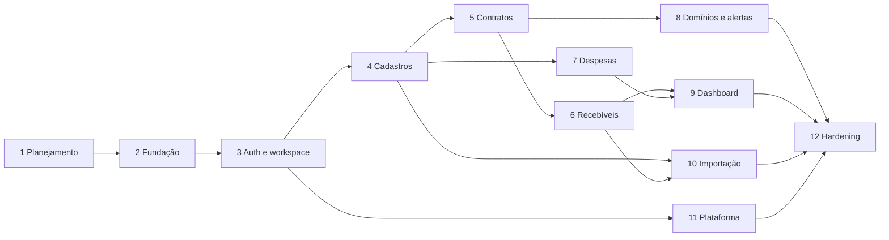

# Plano de implementação e estado atual

## Estado atual

- **Versão atual:** `0.6.1`.
- **Próximo objetivo:** hardening e release candidate para **1.0 Production Ready**.
- **Produto existente:** autenticação, onboarding, workspace, clientes, serviços, cobranças,
  despesas, domínios, alertas, histórico, importação, documentos privados, perfil, configurações,
  RLS, testes e CI/CD já possuem base implementada.

As fases abaixo registram o plano de entrega original. Não devem ser interpretadas como uma ordem de
execução pendente: a próxima frente é fechar lacunas reais de confiabilidade, segurança, cobertura,
acessibilidade, operação e documentação, sem ampliar os módulos de negócio.

## Regras de execução

- Uma fase por vez, com gate explícito.
- Nenhuma migration de negócio sem revisão do modelo, RLS, índices e rollback.
- Nenhum caso de uso financeiro sem testes de dinheiro, datas, autorização e auditoria.
- Dados de desenvolvimento e testes são fictícios.
- Dependências são fixadas e justificadas.
- Mudanças de escopo atualizam requisitos e ADRs antes do código.

## Fase 1 - Planejamento e segurança do repositório

### Entregas

- `PLAN.md` e documentos de produto, arquitetura, dados, UX, execução e decisões.
- ADRs obrigatórios.
- Análise das 18 colunas da planilha.
- `.gitignore`, `.env.example`, política de segredos e auditoria do repositório.

### Gate

- Documentos coerentes e sem dados reais.
- Receita, mídia e repasse separados.
- Dinheiro, datas, recorrência, auditoria e RLS definidos.
- Nenhum código, dependency install ou migration.

## Fase 2 - Fundação técnica

### Tarefas

1. Confirmar novamente versões estáveis nas fontes oficiais.
2. Inicializar Next.js 16 Active LTS no patch corrigido, React e TypeScript estrito.
3. Fixar engine Node LTS, gerenciador, versões e lockfile.
4. Configurar Tailwind, tokens e primitivos acessíveis mínimos.
5. Configurar ESLint, Prettier, Vitest, Testing Library e Playwright.
6. Implementar validação tipada de ambiente com chave publicável e segredos server-only.
7. Criar clientes Supabase browser/server sem regras de negócio.
8. Substituir workflows legados por CI reproduzível e secret scanning.
9. Criar shells públicos/autenticados vazios e tratamento base de erro.
10. Documentar comandos de desenvolvimento em `README.md`/`CONTRIBUTING.md`.

### Testes/gate

- install reproduzível, lint, typecheck, testes vazios de infraestrutura e build.
- Nenhum segredo no bundle ou log.
- Nenhum workflow legado ativo.
- Sem tabelas de negócio ou funcionalidades financeiras.

## Fase 3 - Autenticação, cadastro, perfil e workspace

### Fase 3A - Identidade, workspace, documentos legais e isolamento RLS

1. Migrations de `profiles`, `workspaces`, `workspace_members`, `workspace_settings`, documentos e
   aceites legais.
2. Bootstrap explícito, atômico e idempotente, sem trigger em `auth.users`.
3. RLS, grants mínimos e testes PostgreSQL de usuário A x usuário B, anon e suspensão.
4. Seed exclusivamente fictício e tipos TypeScript gerados do banco local.
5. Avatar e Storage permanecem proibidos até reavaliação do advisory de `sharp`.

Gate: reset e seed reproduzíveis, testes pgTAP, tipos atualizados, advisors e gates da aplicação.

### Fase 3B - Autenticação e experiência de conta

### Tarefas

1. Magic link, confirmação SSR, cadastro, logout e conta suspensa.
2. CAPTCHA, rate limit e mensagens antienumeração.
3. Onboarding visual que chama a RPC aprovada após aceite legal explícito.
4. Perfil textual, preferências e configurações do workspace, usando iniciais/placeholder.
5. Estrutura de exportação/exclusão sem executar exclusão irreversível.

### Testes/gate

- E2E cadastro -> confirmação -> onboarding -> perfil -> logout/login.
- RLS nega leitura/escrita cruzada.
- Nenhum avatar ou upload é criado enquanto o risco temporário de imagens estiver vigente.
- `date`/timezone e cookies passam testes.

Entrega concluída em 2026-07-31: o gate cobre a jornada autenticada real pelo Mailpit e Supabase
local, incluindo cadastro, confirmação, onboarding, perfil, solicitações seguras, logout e login.
Os pedidos de ciclo de conta não executam jobs nem exclusão; retenção e operação administrativa
permanecem explicitamente adiadas para a Fase 11.

## Fase 4 - Cadastros operacionais

### Tarefas

- Clientes, contatos, serviços, fornecedores e categorias.
- Arquivamento, busca, paginação, filtros e auditoria.
- Visão de cliente com placeholders seguros para módulos futuros.

### Testes/gate

- CRUD/arquivamento, validação, acessibilidade e isolamento.
- Cliente arquivado preserva relações.
- Situação financeira ainda aparece como “sem cobrança aberta”, derivada.

## Fase 5 - Contratos, versões e agendas

### Tarefas

- Contratos, itens e versões imutáveis.
- Natureza financeira por item.
- Vigência sem sobreposição.
- Itens únicos/recorrentes, adicionais, pausa e cancelamento.
- `billing_schedules` e simulação do próximo período.
- Função idempotente e testes; agendamento real só após o gate.

### Testes/gate

- Alteração futura não muda cobrança/snapshot anterior.
- Agenda calcula datas no timezone e fim de mês corretamente.
- Duas execuções para agenda/período resultam em uma cobrança.
- Mídia/repasse não entram em receita nos testes.

## Fase 6 - Cobranças, pagamentos e anexos

### Tarefas

- Cobranças, linhas e status calculado.
- Pagamentos e alocações atômicas.
- Rateio proporcional com resíduo determinístico.
- Cancelamento/reembolso e auditoria.
- Bucket de documentos, upload e download autorizado.

### Testes/gate

- Totais reconciliam por natureza.
- Parcial sem alocação completa é rejeitado.
- Over-allocation e cross-workspace são rejeitados no banco.
- Arquivo inválido ou de outro workspace é rejeitado.

## Fase 7 - Despesas e custos

### Tarefas

- Despesas e pagamentos parciais.
- Naturezas de despesa e vínculos.
- Recorrência de despesas com a mesma disciplina idempotente.
- Comprovantes privados.

### Testes/gate

- Resultado inclui somente operacional/direto.
- Mídia e desembolso de repasse afetam saldos próprios.
- Pagamentos não excedem a despesa.

## Fase 8 - Domínios e alertas

### Tarefas

- Domínios, renovação e vínculos.
- Regras configuráveis e defaults.
- Gerador de alertas, deduplicação, resolver/adiar/dispensar.
- Central interna e integração ao dashboard.

### Testes/gate

- Marcos de 30/15/7/1/vencido respeitam timezone.
- Reexecução não duplica alerta.
- Senhas/credenciais não existem no schema/formulário.

## Fase 9 - Dashboard e relatórios

### Tarefas

- Read models por caixa e competência.
- KPIs canônicos e drill-down.
- Visões por cliente/serviço e evolução mensal.
- Estados de atenção, atividade e incompletude.

### Testes/gate

- Cenários fictícios reconciliam até a linha.
- Total bruto não é rotulado como receita.
- Mídia/repasse ficam fora de resultado/margem.
- Filtros e timezone produzem períodos corretos.

## Fase 10 - Importação e exportação

### Tarefas

- Upload temporário privado.
- Detecção por cabeçalho/alias.
- Mapeamento das 18 colunas, prévia e correção.
- Validação completa e confirmação transacional.
- Idempotência do lote, relatório e retenção.
- CSV seguro com decimal string e proteção contra formula injection.

### Testes/gate

- Arquivo fictício cobre todas as 18 colunas.
- Ambiguidades exigem decisão.
- Repetição não duplica.
- Falha não deixa dados parciais.
- Exportação neutraliza células iniciadas por `=`, `+`, `-` ou `@` quando textuais.

## Fase 11 - Administração global e ciclo de conta

### Tarefas

- Tabelas privadas e autorização global.
- Metadados de usuários/workspaces, suspensão/reativação e auditoria.
- Jobs de exportação/exclusão com retenção.
- Página pública de conta suspensa.

### Testes/gate

- Administrador global não consulta dados financeiros ou Storage.
- Toda ação exige motivo e gera evento.
- Suspensão bloqueia sessão/workspace.
- Exclusão respeita retenção documentada e é recuperável até o ponto anunciado.

## Fase 12 - Hardening e publicação

### Tarefas

- Matriz completa de RLS e Storage.
- Testes E2E de fluxos principais.
- Auditoria de acessibilidade e responsividade.
- Revisão de performance, índices e Advisors.
- Cabeçalhos, CSP, cookies, rate limiting e dependências.
- README público, screenshots fictícios, SECURITY, CONTRIBUTING e changelog.
- Revisão de histórico Git e secret scanning.

### Gate final

- CI verde.
- Zero segredo/dado real no histórico.
- Fluxos críticos aprovados em mobile/desktop.
- Backups/restore e operação documentados.
- Limitações do MVP e aviso não contábil visíveis.

## Dependências entre fases

## Riscos e mitigação

| Risco | Mitigação |
|---|---|
| Escopo amplo de MVP | Entregas verticais, gates e nenhuma função futura “pela metade”. |
| RLS incompleta | Policies por operação, índices e matriz de testes cruzados. |
| Decimal convertido para `number` | DTO decimal string e read models/RPCs textuais. |
| Mudança de dia | `date` sem `Date` JS e testes de timezone/DST. |
| Duplicidade de recorrência | Constraint agenda/período e transação idempotente. |
| Upload inseguro | Bucket privado, assinatura de conteúdo, allowlist e limites. |
| Importação ambígua | Prévia e decisão explícita antes da transação. |
| Workflow legado executar em projeto errado | Remover/desativar na Fase 2 antes de habilitar CI. |
| Complexidade de administrador global | Metadados mínimos, schema/rotas separados e zero impersonation. |

## Próximo objetivo de execução

Preparar o Fate Light `0.6.1` para o release candidate 1.0, seguindo o checklist de
[release-v1.md](release-v1.md). A prioridade é: corretude financeira, segurança, confiabilidade,
testes E2E, revisão de consultas/RLS/Storage, responsividade, acessibilidade e operação. Não criar
novos módulos de negócio enquanto os gates existentes não estiverem concluídos.
